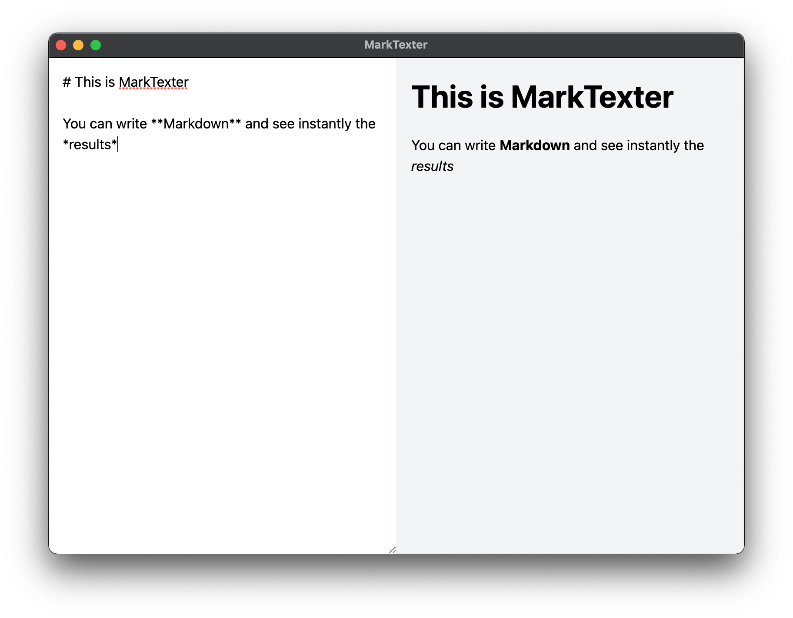

# MarkTexter
Minimalistic Markdown Editor

## How to start developing MarkTexter

1. Install node packages with `npm install`
2. Start debugging with `npm start`

## I just want to use the program
Go to releases and download your OS version.

## Roadmap
- [x] Interpreting Markdown
- [x] Export to PDF
- [x] Support Tables & checkboxes
- [x] Spellchecking
- [x] Context Menu
- [x] Default Program (Mac & Linux)
- [ ] Default Program (Windows)
- [ ] Allow saving same file without menu
- [ ] Recent Opened Files
- [ ] Improve PDF Style
